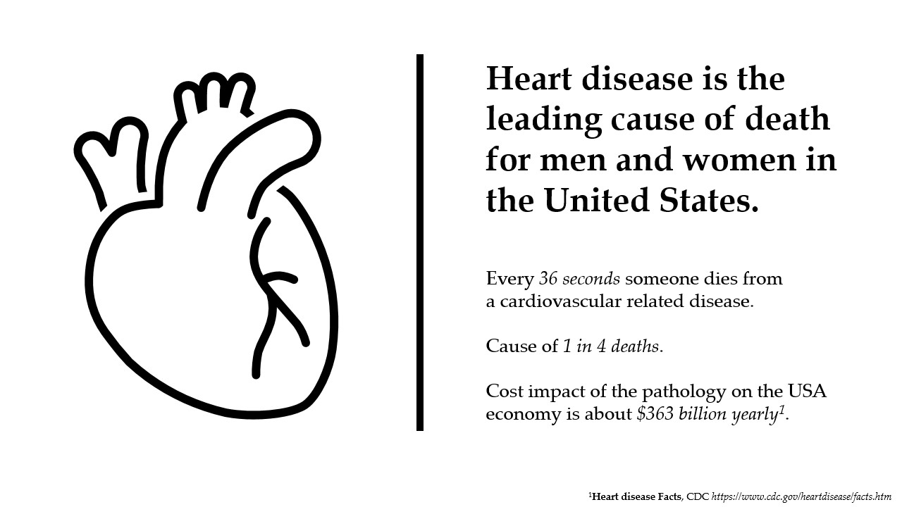
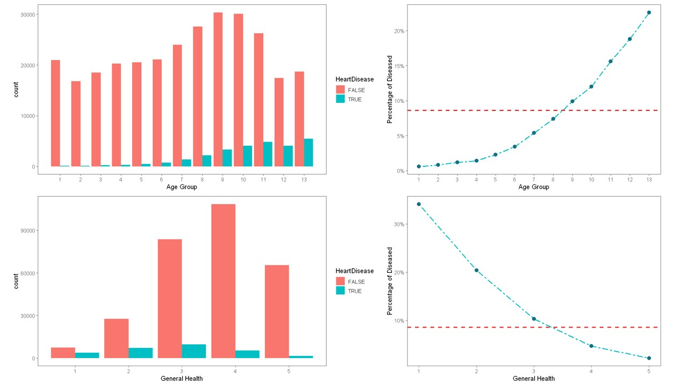
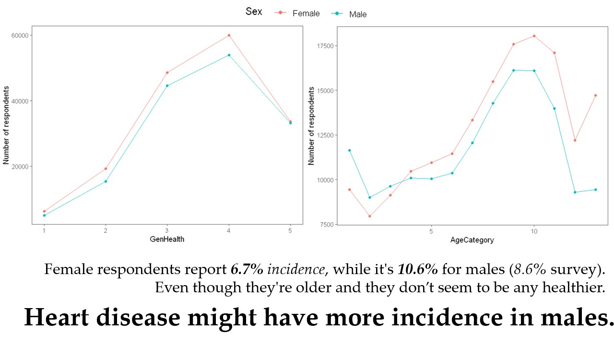
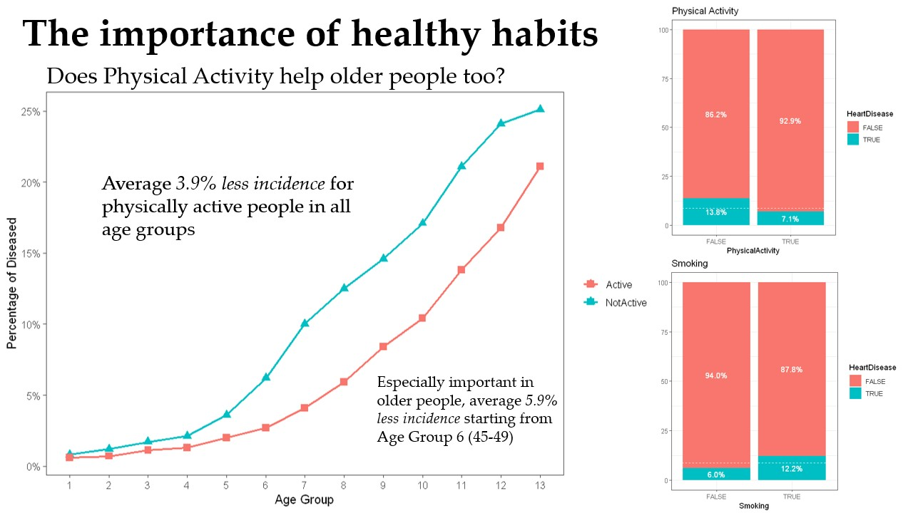

## Heart Disease Classification
This repository hosts an analysis performed on the [Personal Key Indicators of Heart Disease dataset](https://www.kaggle.com/datasets/kamilpytlak/personal-key-indicators-of-heart-disease) from the CDC annual USA health survey.

The objective of the analysis was prediction of incidence of Heart Disease in respondents based on lifestyle indicators such as BMI, Age, physical activity, diseases and mental health.

A comprehensive report on the results of the analysis can be found in [report.pdf](report.pdf).

### Presentation preview
Following are some slides taken from the powerpoint presentation used to present the study keypoints.

