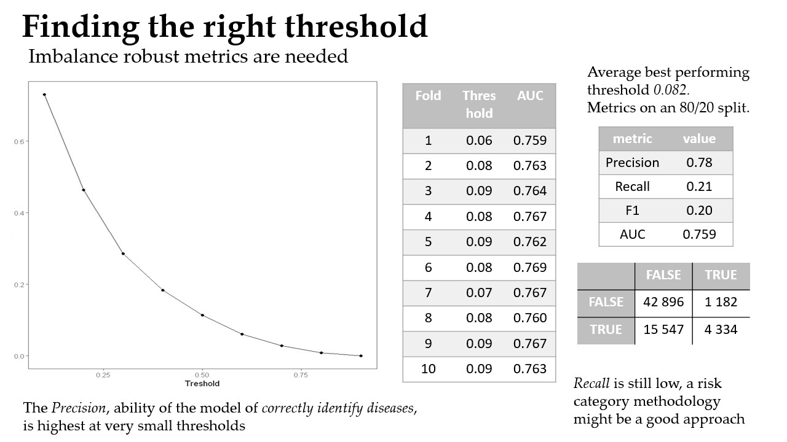

## Heart Disease Classification
This repository hosts an analysis performed on the [Personal Key Indicators of Heart Disease dataset](https://www.kaggle.com/datasets/kamilpytlak/personal-key-indicators-of-heart-disease) from the CDC annual USA health survey.

The objective of the analysis was prediction of incidence of Heart Disease in respondents based on lifestyle indicators such as BMI, Age, physical activity, diseases and mental health.

An AUC score of 0.759 and a Precision score of 0.78 in finding out if the respondent had Heart Disease was achieved by using a Logistic Regression optimizing the threshold for Precision using a nested cross validation. The decision to optimize for Precision was made given the unbalanced nature of the data and the conclusion that correctly identyfing diseased was of more importance than creating false positives, a problem that could be possibly addressed by further work in creating categories of risk depending on the probability output by the model.

A comprehensive report on the results of the analysis can be found in [report.pdf](report.pdf).

### Presentation preview
Following are some slides taken from the powerpoint presentation used to present the study keypoints.

